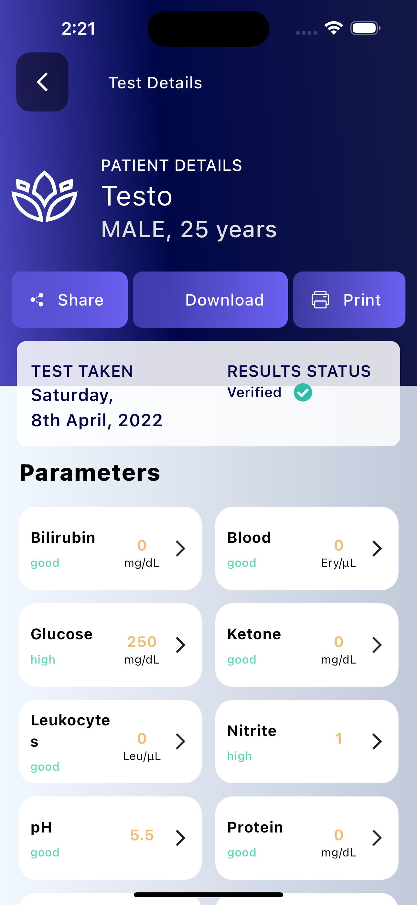

# neodocs

[https://github.com/DavBfr/dart_pdf/issues/384]

I had tried [https://pub.dev/packages/pdf] and [https://pub.dev/packages/syncfusion_flutter_pdf] both the packages it's working fine on IOS device but not working on Android.
I had also mention git-hub issues [https://github.com/DavBfr/dart_pdf/issues/384]. 
I had not used any fontstyle i used simple text .
If any one have any solution please let me know.
